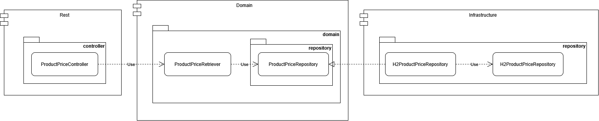

# Product Prices

## Description

Backend application developed with Java and Spring Boot that provides an API to retrieve the applicable price for a product at a given date and time.

The application exposes a REST endpoint that determines which price should be applied based on the product, brand, application date and price priority.

## How to Run

### Requirements

- Java 21
- Maven

### Run the application

Navigate to the `boot` module:

```bash
cd product-prices-boot
```

Then start the Spring Boot application:

```bash
mvn spring-boot:run
```

Once the application is running, the REST API is available at:

```text
http://localhost:8080/v1/prices
```

## API

### Get product price

GET /v1/prices?datetime={datetime}&productId={productId}&brandId={brandId}

#### Parameters

| Parameter | Type | Description |
|---|---|---|
| `datetime` | ISO 8601 DateTime | Date and time for which the price is requested |
| `productId` | Long | Product identifier |
| `brandId` | Long | Brand identifier |

#### Example

GET /v1/prices?datetime=2020-06-14T16:00:00&productId=35455&brandId=1

#### Response

```json
{
  "productId": 35455,
  "brandId": 1,
  "price": 25.45,
  "startDate": "2020-06-14T15:00:00",
  "endDate": "2020-06-14T18:30:00",
  "currency": "EUR",
  "feeId": 2
}
```

## Technical Decisions

### Technologies

* Java 21
* Spring Boot
* Maven
* H2

### Architecture

The project follows a **Hexagonal Architecture** (Ports & Adapters).

The modules are organized as follows:

- `domain`:
  Contains the core domain model: entities, value objects, and business concepts. It has no dependencies on infrastructure or frameworks.

- `application`:
  Contains the application and domain logic, including use cases. It defines the contract required by the application without depending on technical implementations.

- `infrastructure`:
  Contains infrastructure adapters and technical implementations, such as database persistence using JDBC.

- `rest`:
  Acts as an inbound web adapter within the **infrastructure layer**. It contains the REST API adapter, OpenAPI contract specifications, and autogenerated controllers/DTOs. It is kept as a separate module to isolate the external HTTP contract from other infrastructure concerns.

- `boot`:
  Contains application bootstrapping, Spring Boot configuration, and dependency wiring across all modules.

- `coverage`:
  A technical support module used to generate the aggregated JaCoCo test coverage report across the project modules. It is not part of the application runtime or the hexagonal architecture itself.

### Database Access

The application uses **JdbcTemplate** for database access instead of an ORM such as JPA/Hibernate.

This approach keeps the persistence layer lightweight and provides explicit control over SQL queries and database interactions.

It also avoids introducing unnecessary ORM complexity for a simple read-oriented use case such as retrieving the applicable product price.

### Price Selection Strategy

The price selection logic is executed directly at the database level to maximize query efficiency and response speed.

For a given product, brand, and date-time, the repository query filters the active prices matching the requested criteria, orders them by priority, and retrieves directly the single applicable product price.

This approach delegates the filtering and priority sorting to the database engine, avoiding unnecessary data transfer and in-memory processing.

### Error Handling

The REST API uses a centralized exception handling mechanism through `@RestControllerAdvice`.

Specific application exceptions are mapped to the corresponding HTTP status codes:

- `InvalidProductPriceRequestException` → `400 Bad Request`
- `ProductPriceNotFoundException` → `404 Not Found`
- Unexpected `Exception` → `500 Internal Server Error`

All errors follow a consistent `ErrorResponse` structure containing:

- `status`: HTTP status code.
- `code`: application-specific error code.
- `message`: human-readable error message.

This approach keeps error handling centralized and avoids duplicating exception-to-HTTP mapping logic across the REST controllers.

Unexpected internal errors return a generic message to avoid exposing implementation details to API consumers.

```json
{
  "status": 404,
  "code": "PRODUCT_PRICE_NOT_FOUND",
  "message": "There is no product price for the given criteria"
}
```

### API Design

The REST API follows an **API First** approach, using **OpenAPI 3.0.3** as the contract between the API and its consumers.

The API contract is defined in:

`rest/product-prices-rest/src/main/resources/api/rest-productprices.yaml`

The REST API interfaces and models are generated from the OpenAPI specification. This ensures that the implementation remains aligned with the documented API contract and reduces boilerplate code.

All request parameters are defined as **required**:

- `datetime`: Date and time used to determine the applicable product price.
- `productId`: Product identifier.
- `brandId`: Brand identifier.

The API exposes the following endpoint:

- `GET /v1/prices` → Retrieves the applicable product price.

The endpoint follows standard HTTP semantics:

- `200 OK` → Product price successfully retrieved.
- `400 Bad Request` → Invalid request data.
- `404 Not Found` → No product price matches the requested criteria.
- `500 Internal Server Error` → Unexpected internal error.

The API also defines a consistent `ErrorResponse` model for error responses.

The `rest` module is kept separate from `infrastructure` as a technical decision derived from the **API First** approach. It contains the API contract and the generated API interfaces and models, allowing the API to be managed independently from the infrastructure implementations.

### Testing Strategy

The project follows a layered testing strategy, combining unit tests and integration tests.

#### Unit Tests

Unit tests are located across the `application` and `rest` modules using **JUnit 5** and **Mockito**.

- **Domain & Application Layer:** Tests focus on business rules, domain entities, and use case logic, using Mockito to mock repository ports and isolate application behavior.
- **REST Layer:** Tests focus on web adapter logic, HTTP request mapping, parameter validation, and error response handling, using Mockito to mock use cases and services.

#### Integration Tests

Integration tests are located in the `boot` module and validate the application behavior through the REST API.

These tests start the Spring Boot application and verify the complete flow, including the REST layer, application logic and persistence integration.

The integration tests cover the scenarios defined in the exercise requirements, validating the responses indicated on the statement.

### Code Coverage

The project uses JaCoCo to measure test coverage across the different modules.

To generate the aggregated coverage report, run the following command from the project root:

```bash
mvn clean verify
```

The aggregated JaCoCo report will be generated at:

```text
coverage/target/site/jacoco-aggregate/index.html
```

The report includes the coverage of the project modules, excluding OpenAPI-generated classes from the REST module, since this code is generated automatically and is not part of the manually implemented code.


### Product Price Retrieval Flow

The following diagram illustrates the flow used to retrieve the applicable product price, from the REST API to the persistence layer.



### 🚀 Future Improvements and Roadmap

Although the current solution fully satisfies all functional, architectural, and performance requirements, the following improvements have been identified to prepare the service for a large-scale production environment:

#### 1. Observability and Monitoring
* **Distributed Tracing & Metrics:** Integration of **Micrometer** and **Zipkin/Sleuth** to collect performance metrics at entry/exit points and enable distributed request tracing.
* **Structured Logging:** JSON-formatted logging configuration to streamline log ingestion into ELK stacks (Elasticsearch, Logstash, Kibana) or Grafana Loki.

#### 2. Caching and Performance
* **Caching Strategy:** Implementation of a second-level cache or distributed in-memory store (e.g., **Redis** or **Caffeine**) for high-frequency price queries, reducing database load for products and brands with low price variance.

#### 3. Domain Write Operations & Entity Management (CRUD)
* **Price Management Endpoints:** Implementation of write-side use cases (commands) to support adding, updating, and soft-deleting product prices (`POST /prices`, `PUT /prices/{id}`, `DELETE /prices/{id}`).
* **Domain Validation & Invariants:** Enforcing domain business rules for price creation (e.g., overlapping date range validations, priority conflict resolution, and price consistency checks).

